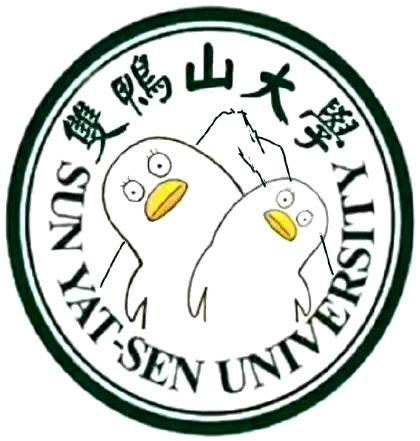
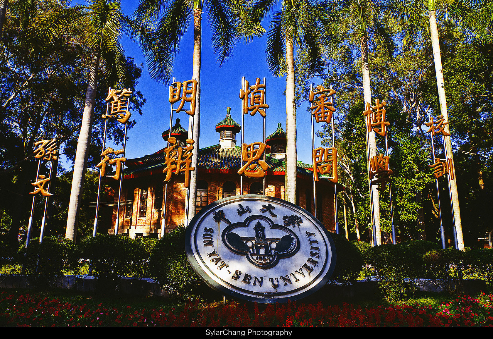
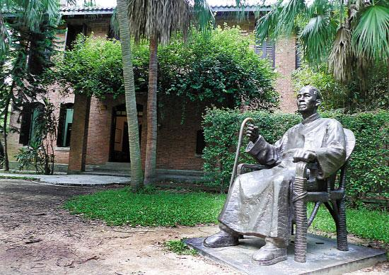

# 双鸭山大学的来历
Author
>中山大学聂羽丞 

## 1 **孙中山变成“双鸭山”**
听过“双鸭山大学”吗？

它是最近非常火的一所著名大学，如果你以为它坐落在中国最东部的地级市——黑龙江省双鸭山市，那就大错特错。它的本名叫中山大学，因英文校名“Sun Yat-sen University”的谐音神似“双鸭山”被一位网友翻译为“双鸭山大学”。

始作俑者“云湖浪子YZ25T”就此回应称，“双鸭山大学”并非错译，而是在自己小圈子里已流传长达五年的一个梗。五年前他在广州坐地铁，路过“中大”站，方知道中山大学的英文名就是“Sun Yat-sen University”，但听报站音像“双鸭山大学”，他还曾在校内网（现人人网）上发照片说：“原来中山大学的英文是....双鸭山大学…”

## **2双鸭山大学的前世今生**
　　中山大学是唯一一所由世纪伟人孙中山先生创办并以其英名命名的高等学府。为培养革命和科学文化建设人才，孙中山于1924年亲手创办了中山大学(原名国立广东大学)。是年2月4日，孙先生下了两道大元帅令。其一：“着将国立高等师范、广东法科大学、广东农业专门学校合并改为国立广东大学”。其二：“派邹鲁为国立广东大学筹备主任”。

　　国立广东大学筹备主任邹鲁是同盟会员、中华革命党人，1923年任广东省财政厅长、国立广东高等师范校长，1924年在国民党“一大”上当选为中央执行委员，会后任中央常务委员、青年部长。学校筹备委员有胡汉民、汪精卫、廖仲恺、伍朝枢、马君武、孙科、李大钊、许崇清、胡适、陈树人、熊希龄、王星拱、邓植仪、何春帆、梁龙、程天固等35人。

　　国立广东大学是以1905年建立的国立广东高等师范和广东法科大学以及1909年建立的省立广东农业专门学校为基础创办的。1924年3月3日，国立广东大学筹备委员会举行第一次筹备会议，通过了国立广东大学组织大纲。根据大纲精神，高师被改编为国立广东大学的文科和理科，法大被改编为法科，农专改编为农科，另外再组建工科和预科，后又设置师范科。

　　孙中山先生重视教育，重视人才培养，注意用革命的理论武装青年学生。1924年1月27日至8月底，孙中山先生先后10多次到国立广东大学礼堂向师生系统讲述三民主义。他的演讲深入浅出，结合日常现象和历史故事，涉及古今中外各派学说，内容极为丰富渊博，风趣盎然，深受师生的欢迎。

　　1924年5月9日，国立广东大学筹备工作完成。6月9日，孙中山先生又下大元帅令：“任命邹鲁为国立广东大学校校长”。

　　同年夏天，国立广东大学首次招收预科学生372名，9月开始上课。

　　1924年11月3日，孙中山先生到黄埔军校演讲。他没有忘记国立广东大学师生，特雇船把国立广东大学的师生接到黄埔，和军校师生一道听演讲。孙中山先生对青年学生寄予厚望，对两校师生语重心长地说：“我们的黄埔学生，都是从各省不远数百里或数千里而来到这个革命学校求学，对于革命都是有很大的希望，很大的抱负的。广大的文学生(指国立广东大学学生)，今日是不远数十里来到黄埔听革命的演说，研究革命的方法，对于革命的前途也当然是很希望成功的。”

　　11月11日，国立广东大学举行成立典礼。孙中山先生亲笔题写了国立广东大学成立训词：“博学审问慎思明辨笃行”。他原计划亲临庆典大会，后因准备北上，未能成行，特委托广东省长胡汉民代表他致训词。典礼由校长邹鲁主持，胡汉民、廖仲恺、汪精卫等国民党要员出席并讲话。

　　
孙中山先生十分关心国立广东大学。无论是在这所高等学府的筹办过程中还是成立以后，他都经常过问、检查、督促学校的工作，帮助学校解决实际问题。笔者在有限的文献材料中查到，从1924年2月4日孙中山下令创办国立广东大学到1925年3月10日这一年零36天的时间里，孙中山先生关于国立广东大学的命令、训令、指令、题词及演讲等就有45篇之多。

　　1924年11月13日，孙中山先生应冯玉祥等邀请离开广州北上。1925年3月12日上午9时30分，伟大的民主主义革命家、中山大学的创办人孙中山先生在北京铁狮子胡同11号行馆逝世，享年59岁。在悼念孙中山期间，1925年3月24日《广州民国日报》刊登国民党员黄行致国民党中央党部函《改广大为中山大学之提议》。孙中山先生的亲密战友廖仲恺先生在国民党第一届中央执行委员会第71次会议提议，将国立广东大学改名为国立中山大学列入议事日程。同年8月5日，国立广东大学第38次校务会议通过决议：将国立广东大学改名为国立中山大学，并呈报国民政府批准。国民党第一届中央执行委员会第108次会议也通过了改国立广东大学为国立中山大学的决议。1926年3月13日，国立广东大学第70次校务会议决定组织筹备中山大学委员会，并提出了拟聘委员名单，呈请国民政府审批。是年6月19日，国民政府批准了由褚民谊、甘乃光、沈同宝、陈树人、宋子文、陈公博、蒋介石、金曾澄、许崇清、郭沫若、邓植仪、黎国昌、熊锐等40人组成的国立中山大学筹备委员会。委员会还有林伯渠、孙科、蔡元培、陈其缓、吴稚晖、顾孟余、李石曾、蒋梦麟、张伯苓、于右任等30名特聘委员。1926年8月17日，国民政府发布命令，正式宣布将国立广东大学改名为国立中山大学。校长为戴季陶。

　　1927年3月1日，国立中山大学举行隆重的开学典礼。来宾有国民党政治分会代表、国民政府代表、教育行政委员会代表、广东省教育厅等数百人。全校师生员工2000多人参加了开学典礼。在开学典礼上，不少人发表了演说。鲁迅先生(时任中山大学文系主任和教务主任)演说的题目是《读书与革命》。鲁迅先生着重从学习目的的角度阐述了孙中山先生倡导的“读书不忘革命，革命不忘读书”。这两句话后来成为中山大学的光荣传统。

　　中山大学的诞生和发展与孙中山先生的英名紧密相联，与中国近代史的变迁密切相关。回顾中山大学75年的发展历程，虽几经曲折，历尽艰辛，但孙中山先生的革命精神中大人没有忘，没有丢、代代相传！继承和发扬孙中山先生的革命精神，是中大人的光荣传统，是中大人宝贵的精神财富，是中大人自强不息的根本

## 3**展望双鸭山大学的未来**

学校使命：以立德树人为根本任务，坚持社会主义办学方向，致力于培养“德才兼备、领袖气质、家国情怀”的优秀人才；传承优秀文化，追求卓越创新，促进国家社会文明事业发展。
战略目标：扎根中国大地，加快进入国内高校第一方阵步伐，努力迈进世界一流大学前列。
办学理念：坚持中国特色社会主义大学办学方向，培养“德才兼备、领袖气质、家国情怀”的社会主义合格建设者和可靠接班人。守护大学精神、文化和价值，守护现代大学制度；倡导 “大学是一个学术共同体”，守护绝大多数人的利益。提高学校教育质量和师资队伍的学术水平；确立教授在学校事务中的学术主导地位。
指导思想：紧紧抓住学科建设这个高校发展永恒的主题，坚持面向学术前沿、面向国家重大战略需求、面向国家和区域经济社会发展，实现文理医工的全方位融合发展。
办学特色：综合性、创新性、开放性。
发展模式：综合性：多学科融合发展；研究型：突出学术研究的地位；开放式：对国际与海外、社会开放办学。

更多信息
>见双鸭山大学官网
>[])(http://www.sysu.edu.cn/2012/cn/index.htm)

