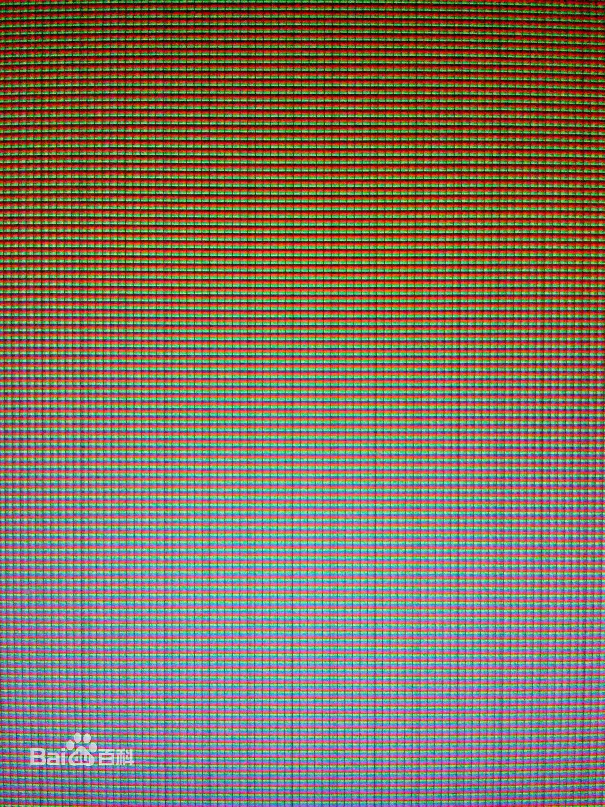

# 计算机的颜色表示
当你看着这个博客的时候你可能注意到字体的颜色有所不同。
你可能会好奇为什么电脑上能显示出这样不同颜色的字体、五颜六色的图片，是像画家那样用调色板调出来的颜色吗

在这篇博客中我将介绍计算机世界中颜色的表示方法。

## RGB表示方法
当你看到这行字时，你以为你看到的是发射粉色光谱的一段话吗

那你就错了！

其实你看到的不过是一群红色绿色和蓝色的点按一定比例均匀分散组成的图像！比如刚刚那行粉色的字,其实就是红色绿色和蓝色的点按照255：192: 203的比例所组成的。

一直以来人们一直想知道眼睛看到颜色的原理经过很久之前的研究发现，人的视网膜内存在者三种视锥细胞，分别含对红，绿，蓝三种颜色敏感的视色素，于是乎，当一定波长的光传到视网膜的时候，按着一定的比例刺激着三种视锥细胞，然后这三种不同的兴奋传到神经中枢，人即产生了颜色的感觉。

因此人们想到了所谓RGB的颜色表示。这种颜色表示就是RGB表示方法。RGB色彩模式是工业界的一种颜色标准，是通过对红(R)、绿(G)、蓝(B)三个颜色通道的变化以及它们相互之间的叠加来得到各式各样的颜色的，RGB即是代表红、绿、蓝三个通道的颜色，这个标准几乎包括了人类视力所能感知的所有颜色，是目前运用最广的颜色系统之一。

## 其他颜色表示方式

### HSL颜色的表示
HSL色彩模式是工业界的一种颜色标准，是通过对色相(H)、饱和度(S)、明度(L)三个颜色通道的变化以及它们相互之间的叠加来得到各式各样的颜色的，HSL即是代表色相，饱和度，明度三个通道的颜色，这个标准几乎包括了人类视力所能感知的所有颜色，是目前运用最广的颜色系统之一。

Hub为色相，无单位以角度表示

Saturation为饱和度，表示的是纯色占的百分比，饱和度为一，表示的就为真正的纯色，越接近于零，则越接近灰色而并非黑色。 

Lightness，就表示颜色的亮度，色调过暗的时候便可调高，亮度为一时白色，越接近于零，越暗，最后为黑色。 

以上是我对计算机颜色表示的认识
感谢观赏
                   from Nie

