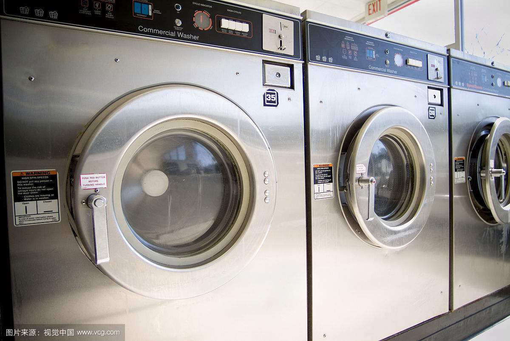

# 一、自顶而下，逐步求精
## 1.自顶而下
将复杂的大问题分解为相对简单的小问题，找出每个问题的关键、重点所在，然后用精确的思维定性、定量地去描述问题。其核心本质是”分解”。 
## 2.逐步求精
将现实问题经过几次抽象（细化）处理，最后到求解域中只是一些简单的算法描述和算法实现问题。即将系统功能按层次进行分解，每一层不断将功能细化，到最后一层都是功能单一、简单易实现的模块

# 二、洗衣机的工作流程

（1）input 预定水量

（2）wateroutswitch(open)打开上水开关
Until getwatervolume==预定水量

（3）do nothing
Until timecounter==预定浸泡时间；

（4）do if(timecounter%2==1) motorrun(left) //当时间为奇数秒时电机左转；
If(timecounter%2==0)motorrun(right) //当时间为偶数秒时电机右转；
Until timecounter==预定洗衣时间；

（5）motorrun(close);
Wateroutswitch(open) //打开排水开关

（6）switch off or stand by;(结束)