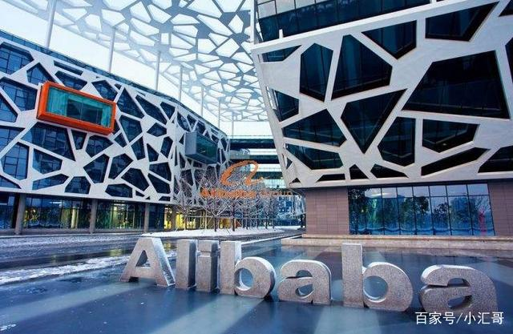

# 风险投资 
## 什么是风险投资 
风险投资（Venture Capital Investment）是指具备资金实力的投资家对具有专门技术并具备良好市场发展前景，但缺乏启动资金的创业家进行资助，帮助其圆创业梦，并承担创业阶段投资失败的风险的投资。投资家投入的资金换得企业的部分股份，并以日后获得红利或出售该股权获取投资回报为目的。风险投资的特色在于甘冒高风险以追求最大的投资报酬，并将退出风险企业所回收的资金继续投入“高风险、高科技、高成长潜力”的类似高风险企业，实现资金的循环增值。投资家以筹组风险投资公司、招募专业经理人，从事投资机会评估并协助被投资事业的经营与管理等方法，早日实现投资收益，降低整体投资风险。

## 风险投资的历史
风险投资的起源可以追溯到19世纪末期，当时美国一些私人银行通过对钢铁、石油和铁路等新兴行业进行投资，从而获得了高回报。1946年，美国哈佛大学教授乔治·多威特和一批新英格兰地区的企业家成立了第一家具有现代意义的风险投资公司--美国研究发展公司（AR&D），开创了现代风险投资业的先河。但是由于当时条件的限制，风险投资在本世纪50年代以前的发展比较缓慢，真正兴起是从70年代后半期开始的。1973年随着大量小型合伙制风险投资公司的出现，全美风险投资协会宣告成立，为美国风险投资业的蓬勃发展注入了新的活力。目前，美国的风险投资机构已接近2000家，投资规模高达600多亿美元，每年约有10000个高科技项目得到风险资本的支持.

　　风险投资在美国兴起之后，很快在世界范围内产生了巨大影响。1945年，英国诞生了全欧洲第一家风险投资公司--工商金融公司。但英国风险投资业起步虽早，发展却很缓慢，直至80年代英国政府采取了一系列鼓励风险投资业发展的政策和措施后，风险投资业在英国才得以迅速发展。其他一些国家如加拿大、法国、德国的风险投资业随着新技术的发展和政府管制的放松，也在80年代有了相当程度的发展。日本作为亚洲的经济领头羊，其风险投资业也开展的如火如荼。到1996年，日本的风险投资机构就有100多家，投资额高达150亿日元以上。但与美国不同的是，日本的风险投资机构中有相当一部分是由政府成立的，这些投资机构也大多不是从事股权投资，而是向高技术产业或中小企业提供无息贷款或贷款担保.

　　我国的风险投资业是在80年代才姗姗起步。1985年1月11日，我国第一家专营新技术风险投资的全国性金融企业--中国新技术企业投资公司在北京成立。同时，通过火炬计划的实施，我国又创立了96家创业中心、近30家大学科技园和海外留学人员科技园，它们都为我国的风险投资事业做出了巨大贡献。 1986年，政协"一号提案"为我国的高科技产业和风险投资发展指明了道路，为我国的风险投资业又掀开了新的一页
## 风险投资的经典案例
### 我国古代风投案例
最为悲情的“风投”案例——荆轲刺秦王

面对日益强大的秦国，燕太子丹准备找最厉害的刺客荆轲刺杀秦王来保燕。

荆轲本卫国人，一个流浪汉，但燕太子倾其心力和他结交，投入了大量的“风投资本”。
据古小说《燕丹子》记载，太子投荆轲所好，奉金锭让荆轲投龟，杀掉千里马献上马肝，断美人手，“盛以玉盘奉之。”燕丹子不惜血本，尽其所欲。燕丹子还让荆轲带着秦王仇人樊於期的人头，以献燕督亢之地图的理由去出使秦国。但荆轲在秦宫殿上却三击不中，反被秦王拔剑杀死。秦王一怒而伐燕，燕太子丹及燕国因搞恐怖活动而遭到彻底的剿杀。

燕太子的“风投项目”以失败而告终，其最大的败因是对项目和项目实施人的选择不当。以恐怖活动来挽救国家的命运本就是个错误的策略，而荆轲的能力也值得怀疑。
### 现代风投经典案例
1. UCWeb

阿里巴巴在2014年收购了移动浏览器公司UCWeb，在当时成为了中国有史以来最大规模的一次互联网交易。阿里巴巴给UCWeb确定的估值约为47亿美元。此外，这笔交易也帮助阿里巴巴在移动领域站稳了脚步，并促使公司市值从800亿美元增长值2300亿美元，相当于增加了三倍。

在收购交易完成之前，UCWeb的首席执行官俞永福曾表示，尽管很多人都有意收购UCWeb，但是他绝对不会出售UCWeb。阿里巴巴的创始人兼首席执行官马云耗费了多年努力才改变了他的想法。

从2008年到2014年，阿里巴巴和UCWeb建立了良好的关系，公司向UCWeb投资了数亿美元，最终持有66%的股权。最后，这一关系取得了丰厚的回报。

UCWeb最早的投资者是Morningside Ventures以及Ceyuan Ventures。它们曾在2007年公司的A轮融资中共同投资了1000万美元。
