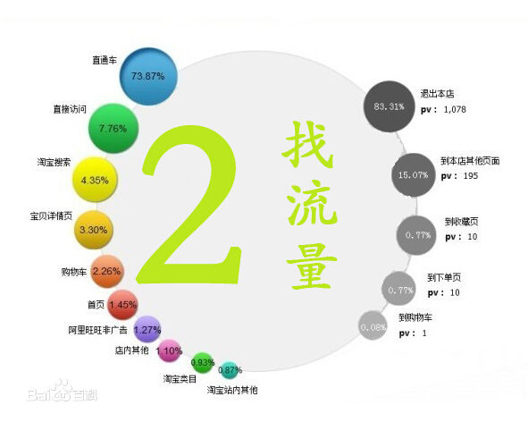
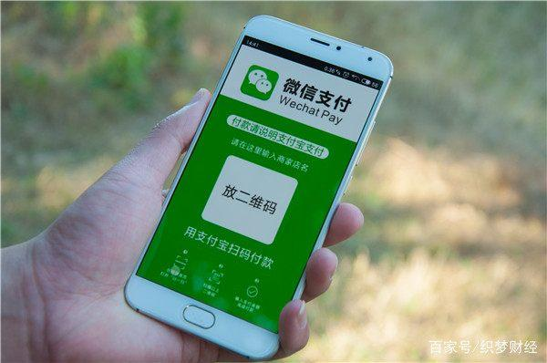

# 互联网时代的盈利模式
## 基本概念
根据百科的定义:
>流量，在规定期间内通过一指定点的车辆或行人数量，在网络指在一定时间内打开网站地址的人气访问量，或者是手机移动数据的通俗意思;

通常说网站流量（traffic）是指网站的访问量，是用来描述访问一个网站的用户数量以及用户所浏览的页面数量等指标，常用的统计指标包括网站的独立用户数量（一般指IP）、总用户数量（含重复访问者）、页面浏览数量、每个用户的页面浏览数量、用户在网站的平均停留时间等。

## 流量的重要性
有人说，任何一家互联网公司，都绕不开一个核心的需求——流量。只有拥有了流量，才能拥有一切。

事实也的确如此，微信号称十亿用户，那就是实打实的十亿流量，假如微信没有这十亿用户，那它什么都不是。

对于当今任何一家互联网企业，流量的作用都尤为重要，只有有了流量，互联网公司才能够盈利，这就不得不提到流量变现。

## 流量变现
### 流量变现的概念
>流量变现是指将网站流量通过某些手段实现现金收益。在互联网行业，有这样一个公式：用户=流量=金钱。要实现流量变现最重要的就是有足够的流量，网站流量指网站的访问量，是用来描述访问一个网站的用户数量以及用户所浏览的页面数量等指标，常用的统计指标包括网站的独立用户数量UV、总用户数量（含重复访问者）、页面浏览数量PV、每个用户的页面浏览数量、用户在网站的平均停留时间等。有了足够的流量还需要强大的变现能力，因此流量变现的关键在于流量和变现方法。流量的关键就在于推广方式和用户粘性.

### 流量变现的方法

#### 1.收会员费

就是VIP收入，原来的人们对于VIP收入并没有这么热衷。但是这随着VIP服务越来越好，VIP的优质内容也越来越多，VIP收入也变得十分可观。比如优酷等视频网站，如果不是会员，就要在每次看视频前被迫看很久的广告，而且有很多电影无法收看

#### 2.销售产品

将流量转化为虚拟服务（例如：优惠券、电影票、电话费），然后我们到实体去体验，说白了就是我们所谓的O2O模式。举个例子来说，现在的大众点评等网站就是靠这样的团购，推荐等方式来盈利的。

#### 3.组织活动

很多的互联网公司致力于做垂直社区，他们所针对的客户群体一般都是具有某一个共同兴趣，或者具有相同气质的用户群体。那么针对这些用户群体组织活动就变得非常容易，很多知识付费性自媒体就是靠着这样的手段将流量变现。

#### 4.教育等线上服务

在线教育，尤其是在线成人教育也是我们现在特别热门的一个方向。你想要通过在线的方式享受服务，接受知识就需通过购买的方式向商家付费，才能够开通权限。成人教育需求量大，流量变现容易，尤其是现在就连驾驶证都可以通过网络教学的方式进行学习，十分方便。

#### 5.卖广告

因为有流量，因此进行广告的投放，这个算是互联网最传统的流量变现方式，也是在各大·互联网公司之间一直占据主流的一种收入。例如：今日头条、爱奇艺等等。
    