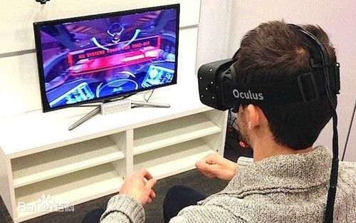

# 职业规划之虚拟现实
## 虚拟现实
>虚拟现实技术是一种可以创建和体验虚拟世界的计算机仿真系统，它利用计算机生成一种模拟环境，是一种多源信息融合的、交互式的三维动态视景和实体行为的系统仿真使用户沉浸到该环境中。

虚拟现实技术是仿真技术的一个重要方向，是仿真技术与计算机图形学人机接口技术多媒体技术传感技术网络技术等多种技术的集合，是一门富有挑战性的交叉技术前沿学科和研究领域。虚拟现实技术(VR)主要包括模拟环境、感知、自然技能和传感设备等方面。模拟环境是由计算机生成的、实时动态的三维立体逼真图像。感知是指理想的VR应该具有一切人所具有的感知。除计算机图形技术所生成的视觉感知外，还有听觉、触觉、力觉、运动等感知，甚至还包括嗅觉和味觉等，也称为多感知。自然技能是指人的头部转动，眼睛、手势、或其他人体行为动作，由计算机来处理与参与者的动作相适应的数据，并对用户的输入作出实时响应，并分别反馈到用户的五官。传感设备是指三维交互设备.

# 虚拟现实的发展现状
1989年VR被首次提出，然而并未获得市场认可。随着Facebook收购Oculus，以及技术的不断完善，VR在2014年迎来发展元年。2014—2016年，VR处于市场培育期，特别是2016年美国消费电子展上，虚拟现实产品成为展会的绝对主角；随着广泛的应用产品出现，2017—2019年，VR将进入快速发展期，行业对标准、相互兼容的应用、配件需求出现快速增长，VR消费级市场认知加深，VR企业级市场将逐步启动发展；预计到2020年左右，虚拟现实市场将进入相对成熟期，硬件解决方案趋合、平台系统开源化、大部分技术难题将有效得以解决、内容支撑全面、应用场景改进，产业链逐渐完善。
## 前景广阔
虚拟现实产品的沉浸感和体验感逐步提升，虚拟现实视频内容和游戏内容日益丰富，虚拟现实在装备制造、教育、文化传媒、旅游、军事、航空航天、装备制造、医疗等行业应用中快速渗透，硬件商、消费者、开发者三方共赢的“平台＋应用”闭环生态圈已经形成。这是一项可能改变未来的颠覆性科技，未来有望成为一些行业发展新的技术支撑。
## 瓶颈亟待突破
就我国的虚拟现实产业而言，前景光明，道路曲折。“目前，无论是人才、资金投入还是政府支持都还远远不够。在产业应用上，VR必须无限接近于真实，因此怎么采集到足够多的真实数据是难点，此外建模、算法和软件实施也是需要进一步攻克的难题。”中关村天合技术成果转化促进中心主任朱希铎说。

# 未来虚拟现实的技术应用及盈利方式
## 娱乐
丰富的感觉能力与3D显示环境使得VR成为理想的视频游戏工具。由于在娱乐方面对VR的真实感要求不是太高，故近些年来VR在该方面发展最为迅猛。如Chicago（芝加哥）开放了世界上第一台大型可供多人使用的VR娱乐系统，其主题是关于3025年的一场未来战争；英国开发的称为“Virtuality”的VR游戏系统，配有HMD，大大增强了真实感；1992年的一台称为“Legeal Qust”的系统由于增加了人工智能功能，使计算机具备了自学习功能，大大增强了趣味性及难度，使该系统获该年度VR产品奖。另外在家庭娱乐方面VR也显示出了很好的前景。

## 医学
外科医生在真正动手术之前，通过虚拟现实技术的帮助，能在显示器上重复地模拟手术，移动人体内的器官，寻找最佳手术方案并提高熟练度。在远距离遥控外科手术，复杂手术的计划安排，手术过程的信息指导，手术后果预测及改善残疾人生活状况，乃至新药研制等方面，虚拟现实技术都能发挥十分重要的作用。
## 军事航天
模拟训练一直是军事与航天工业中的一个重要课题，这为VR提供了广阔的应用前景。美国国防部高级研究计划局DARPA自80年代起一直致力于研究称为SIMNET的虚拟战场系统，以提供坦克协同训练，该系统可联结200多台模拟器。另外利用VR技术，可模拟零重力环境，替非标准的水下训练宇航员的方法
